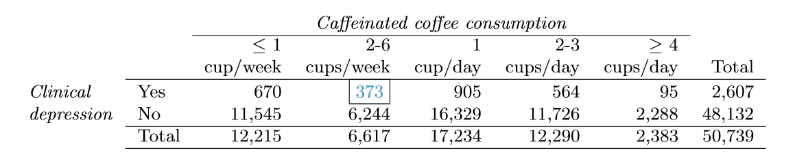

##Graded Questions

Q:1 (6.6) 2010 Healthcare Law. On June 28, 2012 the U.S. Supreme Court upheld the much debated 2010 healthcare law, declaring it constitutional. A Gallup poll released the day after this decision indicates that 46% of 1,012 Americans agree with this decision. At a 95% confidence level, this sample has a 3% margin of error. Based on this information, determine if the following statements are true or false, and explain your reasoning.

  (a) We are 95% confident that between 43% and 49% of Americans in this sample support the decision of the U.S. Supreme Court on the 2010 healthcare law. 
  (b) We are 95% confident that between 43% and 49% of Americans support the decision of the U.S. Supreme Court on the 2010 healthcare law. 
  (c) If we considered many random samples of 1,012 Americans, and we calculated the sample proportions of those who support the decision of the U.S. Supreme Court, 95% of those sample proportions will be between 43% and 49%. 
  (d) The margin of error at a 90% confidence level would be higher than 3%.

**_A: (a) False. The confident interval is used for estimating population proportion. It cannot be used for estimating sample proportion._**

**_(b) True. 95% Confident interval is $46\% \pm 3\% = (43\%, 49\%)$._**

**_(c) True. By definition of confidence interval, if we take many random samples and built a confidence interval from each sample, 95% of times of those intervals would contain the actual population proportion._**

**_(d) False. At 90% confidence level z-value will be `r qnorm(0.950)` and at 95% confidence level z-value will be `r qnorm(0.975)`. As z-value reduces margin of error value reduces._**

Q:2 (6.12) Legalization of marijuana, Part I. The 2010 General Social Survey asked 1,259 US residents: "Do you think the use of marijuana should be made legal, or not?" 48% of the respondents said it should be made legal.

  (a) Is 48% a sample statistic or a population parameter? Explain. 
  (b) Construct a 95% confidence interval for the proportion of US residents who think marijuana should be made legal, and interpret it in the context of the data. 
  (c) A critic points out that this 95% confidence interval is only accurate if the statistic follows a normal distribution, or if the normal model is a good approximation. Is this true for these data? Explain. 
  (d) A news piece on this survey's findings states, "Majority of Americans think marijuana should be legalized." Based on your confidence interval, is this news piece's statement justified?

**_A: (a) As the survey was conducted on 1259 randomly selected US residents, 48% of 1259 US residents responded marijuana should be made legal. So 48% is sample statistic._**

**_(b) Sample size n = 1259, z-value for 95% confidence level is `r qnorm(0.975)`. Proportion of respondents $\hat{p} = 0.48$._**

**_Standard Error(SE) = $\sqrt{p(1-p)/n} = \sqrt{0.48(1 - 0.48)/1259} = `r sqrt(0.48 * (1 - 0.48)/1259)`$ _**

**_Confidence interval (CI) = $\hat{p} \pm z*SE = 0.48 \pm (`r qnorm(0.975)` * `r sqrt(0.48 * (1 - 0.48)/1259)`) = c(`r 0.48 - (qnorm(0.975) * sqrt(0.48 * (1 - 0.48)/1259))`, `r 0.48 + (qnorm(0.975) * sqrt(0.48 * (1 - 0.48)/1259))`)$_**

**_(c) Sample size n = 1259, which less than 10% of US population. Satisfies condition of independence. A sample size of the population that responded marijuana should be made legal, successes = `r round(1259 * 0.48)` and sample size of the population that responded against marijuana should be made legal, failures = `r round(1259 * (1 - 0.48))`. Since successes and failures are higher than 10, it meets success-failure the condition. _**

**_With both the conditions met, sampling distribution $\hat{p}$ is nearly normal. I do not agree with critics and believe normal model is a good approximation._**

**_(d) Yes, I agree with news piece on the survey's findings because upper limit of confidence interval touches close to `r round((0.48 + (qnorm(0.975) * sqrt(0.48 * (1 - 0.48)/1259))) * 100)`%._**

Q:3 (6.20) Legalize Marijuana, Part II. As discussed in Exercise 6.12, the 2010 General Social Survey reported a sample where about 48% of US residents thought marijuana should be made legal. If we wanted to limit the margin of error of a 95% confidence interval to 2%, about how many Americans would we need to survey? 

**_A: z-value for 95% confidence level is `r qnorm(0.975)`. Proportion of respondents $\hat{p} = 0.48$. Margin of error $ME \le 2\% = ME \le 0.02.$_**

**_Margin of error(`ME`) = $z*\sqrt{p(p-1)/n}$_**

```{r, echo=T}
p <- 0.48
z <- qnorm(0.975)
me <- 0.02

n = ((z^2)*p*(1-p))/(me^2)
n 
```

**_We would need at least `r round(n)` participants, to limit the margin of error of a 95% confidence interval to 2%._**

Q:4 (6.28) Sleep deprivation, CA vs. OR, Part I. According to a report on sleep deprivation by the Centers for Disease Control and Prevention, the proportion of California residents who reported insuffcient rest or sleep during each of the preceding 30 days is 8.0%, while this proportion is 8.8% for Oregon residents. These data are based on simple random samples of 11,545 California and 4,691 Oregon residents. Calculate a 95% confidence interval for the difference between the proportions of Californians and Oregonians who are sleep deprived and interpret it in context of the data.

**_A: To answer this question we will use sample distribution of the difference of two proportions_**

```{r, echo=T, message=F}
library(dplyr)
library(knitr)
```

```{r, ecch=T}
sleep.data<-data.frame(state=NA,sample=NA,Yes=NA,No=NA)
sleep.data<-rbind(sleep.data, c("CA","11545","8.0%","92.0%"))
sleep.data<-rbind(sleep.data, c("OR","4691","8.8%","91.2%"))
sleep.data <- na.omit(sleep.data)
row.names(sleep.data) <- NULL

kable(sleep.data, format="pandoc", align="l", row.names = NA, caption = "Sleep deprivation, CA vs. OR")
```

**_Proportion of the sample population of size $n_{CA} = 11545$ that is sleep deprived in $\hat{p}_{CA} = 0.080$, Proportion of the sample population of size $n_{OR} = 4691$ that is sleep deprived in $\hat{p}_{OR} = 0.088$_**

**_Point estimate of the difference: $\hat{p}_{CA} - \hat{p}_{OR} = 0.080 - 0.088 = `r 0.080 - 0.088`$_**

**_Standard Error: $SE = \sqrt{(\hat{p}_{CA}(1 - \hat{p}_{CA})/n_{CA}) + (\hat{p}_{OR}(1 - \hat{p}_{OR})/n_{OR})}$_**

**_$SE = \sqrt{(0.080(1 - 0.080)/11545) + (0.088(1 - 0.088)/4691)} = {`r sqrt((0.080*(1 - 0.080)/11545) + (0.088*(1 - 0.088)/4691))`}$_**

**_For a 95% confidence interval $z^* = `r qnorm(0.975)`: = point \space estimate \pm z^*SE$_**

**_CI = (`r c((0.080 - 0.088)-(qnorm(0.975)*(sqrt((0.080*(1 - 0.080)/11545) + (0.088*(1 - 0.088)/4691)))), (0.080 - 0.088)+(qnorm(0.975)*(sqrt((0.080*(1 - 0.080)/11545) + (0.088*(1 - 0.088)/4691)))))`)_**

**_We are 95% confident that the difference between the proportions of Californians and Oregonians who are sleep deprived is between -1.75% and 0.15%._**

  **_1. Proportion of Californians who are sleep deprived can be as much as -1.75% less than Oregonians._**
  
  **_2. Proportion of Californians who are sleep deprived can be as much as 0.15% more than Oregonians._**
  
  **_3. As interval level includes `0` there may be no difference, proportion of Californians who are sleep deprived are same Oregonians._**

Q:4 (6.44) Barking deer. Microhabitat factors associated with forage and bed sites of barking deer in Hainan Island, China were examined from 2001 to 2002. In this region woods make up 4.8% of the land, cultivated grass plot makes up 14.7%, and deciduous forests makes up 39.6%. Of the 426 sites where the deer forage, 4 were categorized as woods, 16 as cultivated grassplot, and 61 as deciduous forests. The table below summarizes these data.

(a) Write the hypotheses for testing if barking deer prefer to forage in certain habitats over others. 
(b) What type of test can we use to answer this research question? 
(c) Check if the assumptions and conditions required for this test are satisfied. 
(d) Do these data provide convincing evidence that barking deer prefer to forage in certain habitats over others? Conduct an appropriate hypothesis test to answer this research question.

```{r, echo=T}
deer.data<-data.frame(type=NA,woods=NA,grassplot=NA,forests=NA,other=NA,total=NA)
deer.data<-rbind(deer.data, c("Deer forage observed","4","16","61",426-(4+16+61),426))
deer.data<-rbind(deer.data, c("Deer forage observed%",paste0(round(4*100/426,4),"%"), paste0(round(16*100/426,4),"%"), paste0(round(61*100/426,4),"%"), paste0(round((426-(4+16+61))*100/426,4),"%"),"100%"))

deer.data <- na.omit(deer.data)
row.names(deer.data) <- NULL
kable(deer.data, format="pandoc", align="l", row.names = NA, caption = "Barking deer data")
```

**_A: (a) Null Hypothesis $H_{0}$: There is no difference in barking deer preference to forage in certain habitats over others._**

**_Alternative Hypothesis $H_{A}$: There is difference in barking deer preference to forage in certain habitats over others._**

**_(b) We can use the chi-square test to answer the research question. Since region is classified into different habitats we want to find out if barking deer prefer to forage in certain habitats over other._**

**_(c) Each case is independent of other as the region is classified in different habitats. It meets independence condition._**

**_Each cell should have at least 5 cases. In our case woods bin, under observed have 4 cases. We are assuming it is acceptable._**

**_Standard Error of point estimate (SE) = $\sqrt{Region \space Expected}$_**

**_(d) Considering Region Expected as null values,  `z-value` for each case: $\frac{{observed \space point \space estimate} - {null \space value}}{SE}$_**

**_Degrees of freedom $df = number of bins - 1 = 4 - 1 = 3$_**

```{r, echo=T}
options("scipen"=100, "digits"=4)

region.deer.data<-data.frame(type=NA,woods=NA,grassplot=NA,forests=NA,other=NA,total=NA)
region.deer.data<-rbind(region.deer.data, c("Region Expected%","4.8%","14.7%","39.6%",paste0(100-(4.8+14.7+39.6),"%"), "100%"))
region.deer.data<-rbind(region.deer.data, c("Deer forage Observed%",paste0(round(4*100/426,4),"%"), paste0(round(16*100/426,4),"%"), paste0(round(61*100/426,4),"%"), paste0(round((426-(4+16+61))*100/426,4),"%"),"100%"))
region.deer.data <- na.omit(region.deer.data)
row.names(region.deer.data) <- NULL
kable(region.deer.data, format="pandoc", align="l", row.names = NA, caption = "Region - Deer forage Data")

#Numeric data
region.deer.data2 <- 
  data.frame(type = gsub("\\%","",region.deer.data$type), 
             woods = as.numeric(gsub("\\%","",region.deer.data$woods)),
             grassplot = as.numeric(gsub("\\%","",region.deer.data$grassplot)),
             forests = as.numeric(gsub("\\%","",region.deer.data$forests)),
             other = as.numeric(gsub("\\%","",region.deer.data$other)),
             stringsAsFactors = F)


#Calculate Z-value for each bin
fn_zValue <- function(x,y){return ((x-y)/sqrt(y))}

region.deer.zval <- data.frame(calc=NA,woods=NA,grassplot=NA,forests=NA,other=NA)

region.deer.zval <- rbind(region.deer.zval, 
                          c("zValue",woods = fn_zValue(region.deer.data2$woods[region.deer.data2$type == "Deer forage Observed"], region.deer.data2$woods[region.deer.data2$type == "Region Expected"]),
                          grassplot = fn_zValue(region.deer.data2$grassplot[region.deer.data2$type == "Deer forage Observed"], region.deer.data2$grassplot[region.deer.data2$type == "Region Expected"]),
                          forests = fn_zValue(region.deer.data2$forests[region.deer.data2$type == "Deer forage Observed"], region.deer.data2$forests[region.deer.data2$type == "Region Expected"]),
                          other = fn_zValue(region.deer.data2$other[region.deer.data2$type == "Deer forage Observed"], region.deer.data2$other[region.deer.data2$type == "Region Expected"])))

#Calculate Z-value square for each bin
region.deer.zval <- rbind(region.deer.zval, 
                          c("zValue-square",woods = fn_zValue(region.deer.data2$woods[region.deer.data2$type == "Deer forage Observed"], region.deer.data2$woods[region.deer.data2$type == "Region Expected"])^2,
                          grassplot = fn_zValue(region.deer.data2$grassplot[region.deer.data2$type == "Deer forage Observed"], region.deer.data2$grassplot[region.deer.data2$type == "Region Expected"])^2,
                          forests = fn_zValue(region.deer.data2$forests[region.deer.data2$type == "Deer forage Observed"], region.deer.data2$forests[region.deer.data2$type == "Region Expected"])^2,
                          other = fn_zValue(region.deer.data2$other[region.deer.data2$type == "Deer forage Observed"], region.deer.data2$other[region.deer.data2$type == "Region Expected"])^2))

region.deer.zval <- na.omit(region.deer.zval)
row.names(region.deer.zval) <- NULL
region.deer.zval <- data.frame(region.deer.zval, stringsAsFactors = F)
region.deer.zval$woods <- as.numeric(region.deer.zval$woods)
region.deer.zval$grassplot <- as.numeric(region.deer.zval$grassplot)
region.deer.zval$forests <- as.numeric(region.deer.zval$forests)
region.deer.zval$other <- as.numeric(region.deer.zval$other)

kable(region.deer.zval, format="pandoc", align="l", row.names = NA, caption = "Region - Deer forage Z-Value Data")

chisqvalue <- region.deer.zval$woods[region.deer.zval$calc == "zValue-square"] + region.deer.zval$grassplot[region.deer.zval$calc == "zValue-square"] + region.deer.zval$forests[region.deer.zval$calc == "zValue-square"] + region.deer.zval$other[region.deer.zval$calc == "zValue-square"]

#Degrees of freedom df = number of bins - 1
df <- 4 - 1

# Check for tail end data
pvalue <- 1 - pchisq(chisqvalue, 3)

```

**_chi-squared value ${\chi}^2 = `r chisqvalue`$_**
**_p-value for $(`r c(chisqvalue, df)`) = `r options("scipen"=100, "digits"=20); c(pvalue)`$_**

**_As p-value is less than 5% significance level, we reject null hypothesis $H_{0}$. And conclude there is difference in barking deer preference to forage in certain habitats over others._**


Q:4 (6.48) Coffee and Depression. Researchers conducted a study investigating the relationship between caffeinated coffee consumption and risk of depression in women. They collected data on 50,739 women free of depression symptoms at the start of the study in the year 1996, and these women were followed through 2006. The researchers used questionnaires to collect data on caffeinated coffee consumption, asked each individual about physician-diagnosed depression, and also asked about the use of antidepressants. The table below shows the distribution of incidences of depression by amount of caffeinated coffee consumption.



  (a) What type of test is appropriate for evaluating if there is an association between coffee intake and depression? 
  (b) Write the hypotheses for the test you identified in part (a). 
  (c) Calculate the overall proportion of women who do and do not suffer from depression. 
  (d) Identify the expected count for the highlighted cell, and calculate the contribution of this cell to the test statistic, i.e. $(Observed - Expected)^2/Expected$. 
  (e) The test statistic is ${\chi}^2$ = 20 .93. What is the p-value? 
  (f) What is the conclusion of the hypothesis test? 
  (g) One of the authors of this study was quoted on the NYTimes as saying it was "too early to recommend that women load up on extra coffee" based on just this study. Do you agree with this statement? Explain your reasoning.

**_A: (a) Chi-square test may be used for evaluating if there is an association between coffee intake and depression._**

**_(b) Null Hypothesis $H_{0}$: There is no relationship between categorical variables caffeinated coffee consumption and risk of depression in women. Two categorical variables are independent._**

**_Alternative Hypothesis $H_{A}$: There is a relationship between categorical variables caffeinated coffee consumption and risk of depression in women. Two categorical variables are dependent._**

**_(c) Women who do not suffer from depression $\hat{p}_{no-dep}$: `r round(48132/50739,3)`. _**
**_Women who suffer from depression $\hat{p}_{dep}$: `r round(2607/50739,3)`_**

**_(d) Women who are consuming 2-6 cups of coffee and feel depression Observed: 373._**

**_Expected: $\frac{row \space total * column \space total}{sample \space size} = \frac{2607  * 6617}{50739}$ = `r round(2607  * 6617/50739)`._**

**_${\chi^2}_{2-6 \space cups}:$ $(Observed - Expected)^2/Expected = (373 - 340)^2/340$ = `r round((373 - 340)^2/340,4)`_**

**_(e) chi square value ${\chi}^2$ = 20.93, degrees of freedom $df = (columns - 1) * (rows - 1) = (5 - 1) * (2 - 1) = `r (5 - 1) * (2 - 1)`$_**

**_$p-value:$ `r 1 - pchisq(20.93, 4)`_**

**_(f) Since p-value is less 5% significance level, we reject null hypothesis._**

**_(g) As p-value is very small 0.0003, I agree with authors of this study. This is `Type II error`, failing to reject the null hypothesis when the alternative hypothesis is true. With respect to the study, there is 0.0003% chance that categorical variables caffeinated coffee consumption and risk of depression in women are related. This is statistically significant result, might not be practically significant._**

